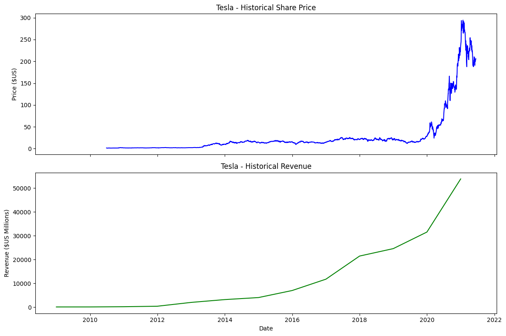
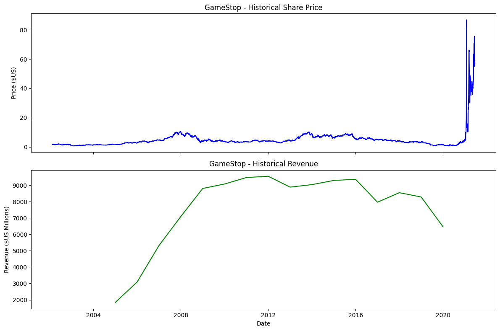

# 📈 Analyse de Données Boursières : Tesla & GameStop

Ce projet a été réalisé dans le cadre de la certification **IBM Data Science**. Il consiste à extraire des données financières (prix des actions et revenus) pour comparer leurs évolutions via un tableau de bord interactif.

## 🚀 Aperçu du Projet

L'objectif est de corréler visuellement l'évolution du prix des actions avec les revenus trimestriels et annuels déclarés.

### Fonctionnalités clés :
* **Extraction boursière** : Utilisation de `yfinance`.
* **Web Scraping** : Extraction des revenus via `BeautifulSoup`.
* **Nettoyage de données** : Traitement avec `Pandas` (nettoyage des symboles monétaires et types de données).
* **Visualisation** : Dashboards complexes à double axe (Prix vs Revenus).

---

## 📊 Visualisation (Screenshots)

> **Note :** Si les images ne s'affichent pas, vérifiez que vos fichiers sont bien placés dans le dossier `/screenshots`.

### 1. Dashboard Tesla

*Comparaison de la croissance du prix de l'action par rapport aux revenus de Tesla.*

### 2. Dashboard GameStop

*Visualisation des données de GameStop, incluant les périodes historiques de volatilité.*

---

## 🛠️ Installation et Prérequis

Pour exécuter ce notebook localement, installez les dépendances suivantes :

```bash
pip install -r requirements.txt
```

> **Note :** Si vous avez des problèmes d'installation, consultez la documentation officielle de `yfinance` et `pandas`.

## 📂 Structure du Projet

Le dépôt est organisé comme suit :

* **Revenue Data and Building a Dashboard.ipynb** : Le notebook principal contenant tout le code.

* **requirements.txt** : Liste des bibliothèques nécessaires.

* **screenshots/** : Dossier contenant les captures d'écran des résultats.

### Étapes du Code :
#### 1. Extraction des données boursières de Tesla.

#### 2. Web Scraping des revenus de Tesla.

#### 3. Extraction des données boursières de GameStop.

#### 4. Web Scraping des revenus de GameStop.

#### 5. Génération du graphique Tesla via la fonction make_graph.

#### 6. Génération du graphique GameStop.

## 📋 Crédits
Ce projet fait partie du programme d'apprentissage d'IBM Skills Network.

Auteur original : Joseph Santarcangelo (IBM)

Réalisation : Abdoul Kader Kassa / Kvdrx
